# おなか日記

## 📡 使用ライブラリ・フレームワーク

| ライブラリ・フレームワーク | バージョン | 使用意図 |
| --- | --- | --- |
| Dart | v3.0.5 | クライアント開発向けプログラミング言語 |
| Flutter | v3.0.5 | モバイルアプリケーションフレームワーク |

## ER 図

```mermaid

---
title: ER図
---

erDiagram
  direction LR
  users {
    Int id PK "ID"
    String name "ユーザー名"
    String email_address UK "メールアドレス"
    datetime create_datetime "作成日"
    datetime update_datetime "更新日"
  }
  diaries {
    Int id PK "ID"
    Int users_id FK "ユーザーID"
    String breakfast "朝ごはん"
    String lunch "昼ごはん"
    String dinner  "夜ごはん"
    datetime toilet_date "排便日"
    String toilet_status "うんこの状態"
    Int stomachache_level "腹痛レベル"
    datetime create_datetime "作成日"
    datetime update_datetime "更新日"
  }
  users ||--o{ diaries : ""

```

